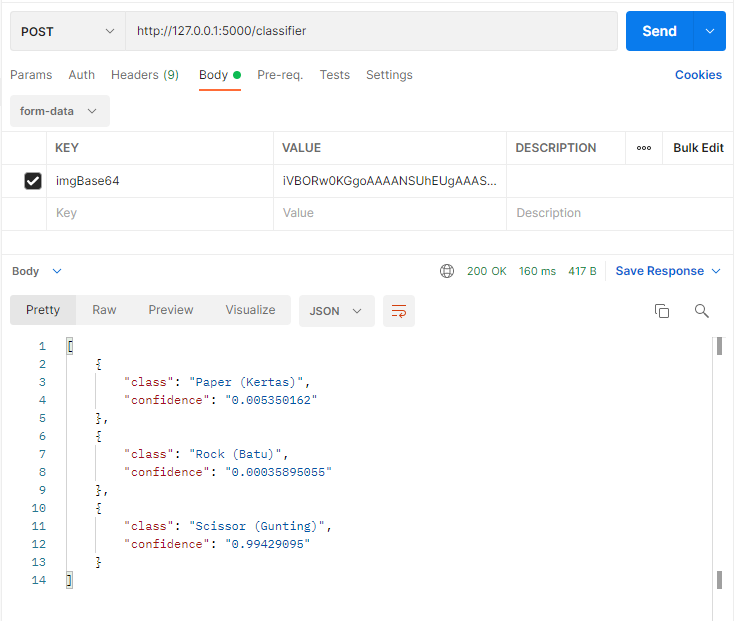

# model-server-side

## How to Use
### 1) Clone Repo
```bash
git clone https://github.com/reevald/model-server-side.git
```
### 2) Install library
```bash
pip install -r requirements.txt
```
### 3) Run!
```bash
flask run
```
## API
